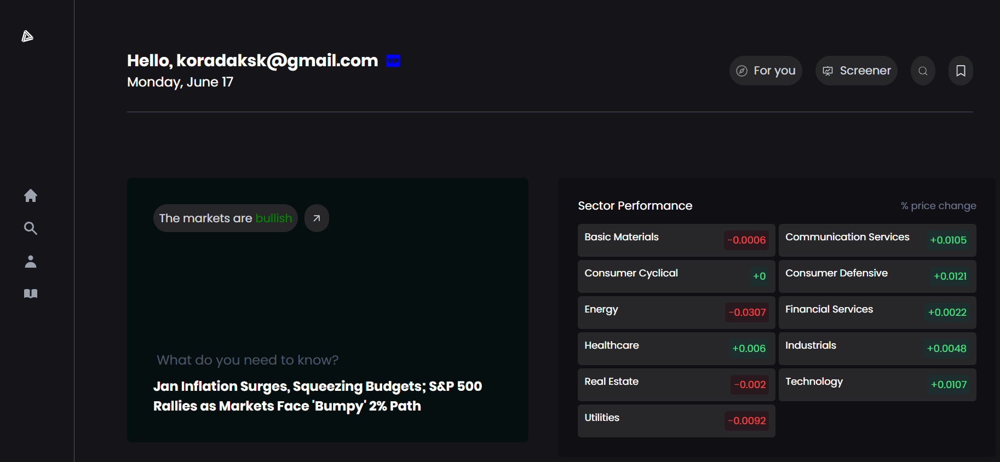
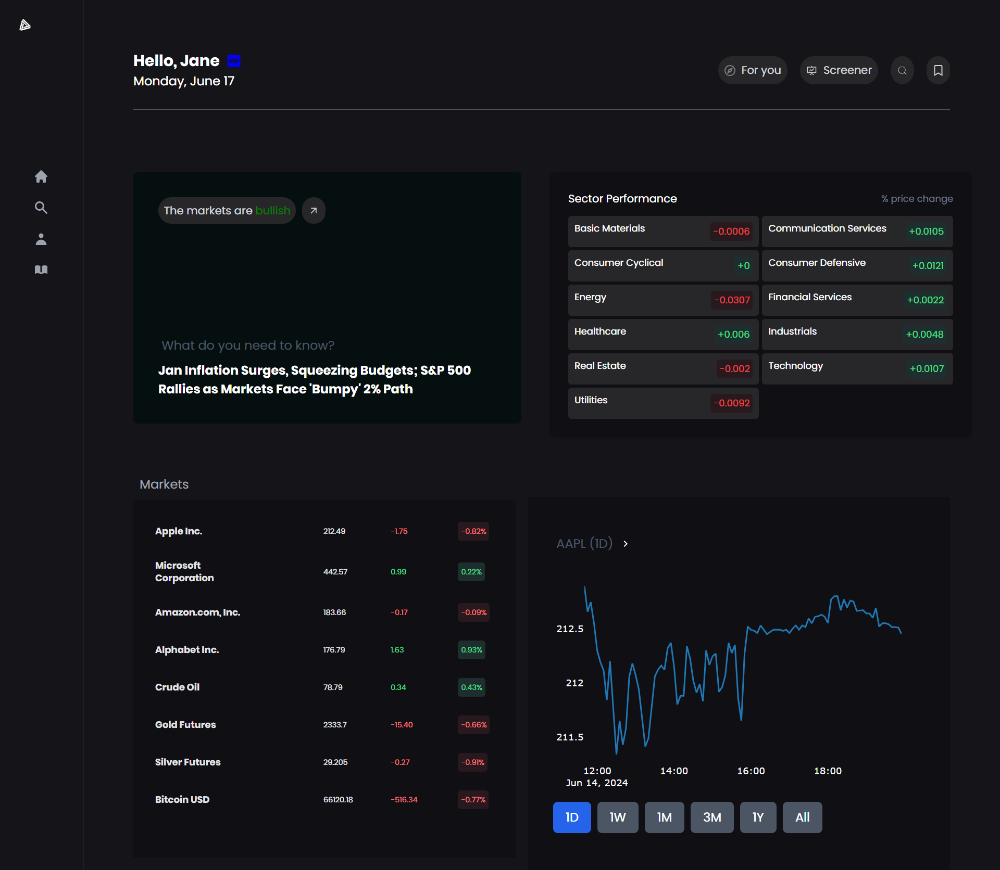
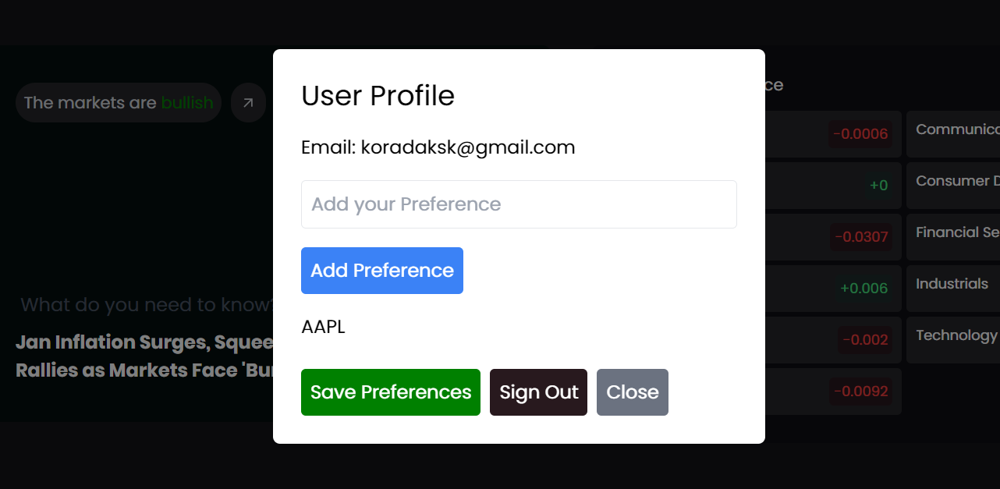

# Financial Stocks and Market Analysis Dashboard
# Imp Note
- *** Since the API's are rate-limited, please open the website quite a few times else you may not see the analytics when you reach a specific limit.

## Libraries used/ Tech-stack
- Reactjs library for frontend ⚛️
- Redux-toolkit for global state management ⚛️
- firebase for authentication and real-time database integration 🔥🗃️
- JavaScript 🧑‍💻
- Vite bundler⚡

## Additional/ Secondary libraries and frameworks used
- Tailwind CSS 💨 (visit the official docs: `https://tailwindcss.com/`)
- plotly library for charts (visit the official docs: `https://plotly.com/javascript/react/`)

## API's used for data (rate-limited for free-tier)
- Alpha Vantage (visit the official docs: `https://www.alphavantage.co/documentation/`)
- Financial Modelling Prep (FMP) API (visit the official docs: `https://site.financialmodelingprep.com/developer/docs`)

## Features
- Realtime market analysis using dashboard which comes with
   - Summary/ News component for latest updates (currently hard-coded)
   - Performance of Various Market Sectors (base on percent change)
   - Market Overview for current value of the stock, daily change and percent change
   - Charts which are mutable by selecting your favourable stock/ market from Market Overview for analyzing
    - Comes with feature of time-based analysis - tune it between days, weeks and years
    - Charts used for analysis: Line Chart, Bar Chart and Scatter Plot
- Authentication for user Authorization
   - Signup to create an Account (Email & Password)
   - Signin/login to your Account
- Database Integration
   - Add and save your market preferences for later reference
   - Hover over user-icon and navigate to profile component to add and save your market preferences after your analysis
   - You can logout from the app

## Additional features in mind
- Search Feature might be more meaningful when fetched more market data from API. 
- Since the API's are of trial version and rate-limited, we could implement it in the future when we fetch more amount of data

## Snaps of the Project
- 
- 
- 

## Local Setup
- clone using `git clone <git url>`
- cd into the folder `StockBoard`
- install the required dependencies using `npm install`
- start locally using the command `npm run dev`

